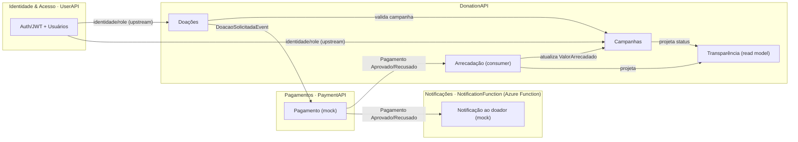

# Context Map

> Relação entre os Bounded Contexts e como se integram. Detalhe de cada contexto em [[Bounded Contexts]]; eventos em [[Domain Events]].

## Mapa

## Relações (resumo)
- **Identidade & Acesso** é *upstream* de todos (fornece identidade e role).
- **Doações** depende de **Campanhas** (campanha precisa existir, estar `Ativa` e dentro do período).
- **Pagamentos** integra com Doações via eventos (saga) — sem acesso a banco alheio.
- **Arrecadação** (consumer) consolida o `ValorArrecadado` em **Campanhas** e projeta o read model de **Transparência**.
- **Transparência** é *downstream* puro: só lê a projeção (Cosmos).
- **Notificações** consome o resultado do pagamento (subscription própria, pub/sub) e **notifica o doador** (canal mock); é *downstream* da Pagamentos e **independente** da Arrecadação. Ver [[PRD-07 - Notificações]].

**Relacionados:** [[Bounded Contexts]] · [[Domain Events]] · [[Visão Geral de Arquitetura]]
