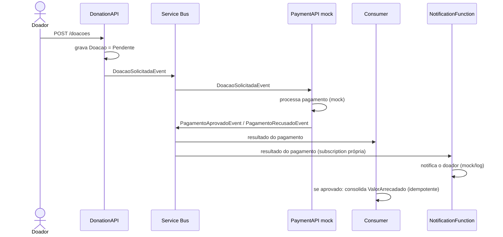

# Domain Events

> Eventos de domínio que cruzam serviços via **Azure ServiceBus**. Base do fluxo de doação (RF06) e da consolidação do Painel de Transparência (RF05). Relacionado a [[Event Storming]], [[Requisitos Funcionais]] e [[Context Map]].

## Saga de doação (2 eventos)

O processamento de uma doação é uma **saga coreografada** entre **DonationAPI** e **PaymentAPI**. Cada serviço escreve **apenas no seu próprio banco** (database-per-service); a comunicação entre eles é só por eventos.

1. **DonationAPI** recebe a intenção, grava a `Doacao` como `Pendente` e publica **`DoacaoSolicitadaEvent`**.
2. **PaymentAPI** consome, processa o pagamento no **gateway simulado (mock)** e publica **`PagamentoAprovadoEvent`** ou **`PagamentoRecusadoEvent`**.
3. **DonationAPI** consome o resultado em um **consumer/BackgroundService próprio** (o "Worker" citado em RF04/RF05/RF06): se aprovado, marca a `Doacao` como `Aprovada` e consolida o `ValorArrecadado`; se recusado, marca como `Recusada`. **Nunca** escreve o `ValorArrecadado` de forma síncrona no request.

## Catálogo de eventos

| Evento | Publicado por | Consumido por | Quando | Payload (resumo) |
|--------|---------------|---------------|--------|------------------|
| `DoacaoSolicitadaEvent` | DonationAPI | PaymentAPI | Após gravar a `Doacao` como `Pendente` | `doacaoId`, `idCampanha`, `valorDoacao`, `formaPagamento`, `doadorId`, `doadorEmail`, `doadorNome` |
| `PagamentoAprovadoEvent` | PaymentAPI | DonationAPI · NotificationFunction | Pagamento aprovado pelo mock | `doacaoId`, `idCampanha`, `valorDoacao`, `pagamentoId`, `doadorId`, `doadorEmail`, `doadorNome` |
| `PagamentoRecusadoEvent` | PaymentAPI | DonationAPI · NotificationFunction | Pagamento recusado pelo mock | `doacaoId`, `idCampanha`, `motivo`, `valorDoacao`, `doadorId`, `doadorEmail`, `doadorNome` |

## Notificação ao doador (2º consumidor)

Além do consumer de arrecadação da DonationAPI, os eventos de resultado (`PagamentoAprovadoEvent` / `PagamentoRecusadoEvent`) são consumidos por uma **Azure Function** (`NotificationFunction`, gerenciada, **fora do AKS**) que **notifica o doador** (canal **mock/log**). Para suportar dois consumidores independentes, esses eventos são distribuídos via **tópico (pub/sub)**: cada consumidor tem **subscription própria**, com seu próprio *max delivery count* + **DLQ**. A Function **nunca** escreve o `ValorArrecadado`; uma falha nela não afeta a consolidação. Detalhe em [[PRD-07 - Notificações]].

**Enriquecimento dos eventos:** os payloads carregam `doadorEmail`/`doadorNome` — a DonationAPI os obtém das **claims do JWT** no `POST /doacoes` (RN01.3) e a PaymentAPI os **repassa** nos eventos de resultado — para a Function notificar **sem** chamada síncrona à UserAPI.

## Garantias

- **Entrega:** ao menos uma vez (*at-least-once*) — ver [[Requisitos Não Funcionais|RNF11]].
- **Idempotência:** o consumer da DonationAPI deduplica por `doacaoId` (tabela de eventos processados / inbox) — RN06.10, [[Requisitos Não Funcionais|RNF12]].
- **Falhas:** reentrega via *max delivery count* do ServiceBus; após o limite, a mensagem vai para a **DLQ** — [[Requisitos Não Funcionais|RNF13]].
- **Consistência:** o `ValorArrecadado` é eventualmente consistente (janela alvo < 10 s) — RN05.4, [[Requisitos Não Funcionais|RNF15]].

**Relacionados:** [[Requisitos Funcionais]] (RF05, RF06) · [[Requisitos Técnicos]] · [[Requisitos Não Funcionais]] · [[Event Storming]]
