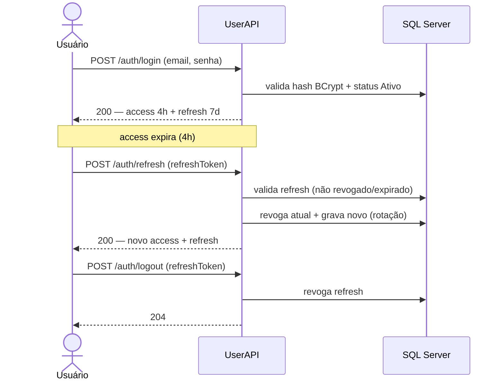

# PRD-01 — Autenticação & Autorização

## 1. Visão Geral
A plataforma precisa garantir que cada operação seja feita por um usuário identificado e
autorizado. Este PRD cobre o **login** (emissão de tokens), a **renovação de sessão** via
refresh token e a **autorização por role (RBAC)** que protege todos os endpoints. É a base de
segurança da qual RF02, RF04 e RF06 dependem.

## 2. Atores / Personas
| Ator | Papel | Permissão (role) |
|------|-------|------------------|
| Visitante | Usuário anônimo (pré-login) | — |
| Doador | Faz doações e gere os próprios dados | `Doador` |
| GestorONG | Administra usuários e campanhas | `GestorONG` |

## 3. User Stories
- Como **Doador/GestorONG**, quero fazer login com email e senha, para acessar as funções da minha role.
- Como **usuário autenticado**, quero renovar minha sessão via refresh token, para não relogar a cada 4h.
- Como **sistema**, quero negar acesso sem token (401) ou com role insuficiente (403), para proteger os endpoints.
- Como **GestorONG**, quero que só minha role acesse endpoints de gestão.

## 4. Requisitos Funcionais
| ID | Requisito | Prioridade |
|----|-----------|-----------|
| RF-1 | Autenticar via email + senha e emitir par access/refresh token | Must |
| RF-2 | Renovar sessão via refresh token (rotativo) | Must |
| RF-3 | Autorizar acesso a endpoints por role (RBAC) | Must |
| RF-4 | Revogar refresh token (logout / inativação de usuário) | Should |

## 5. Regras de Negócio
- **RN01.1** — Existem exatamente duas roles: `GestorONG` e `Doador`.
- **RN01.2** — Login exige email + senha; a senha é comparada contra o hash BCrypt.
- **RN01.3** — O **access token** (JWT) carrega `userId`, `email`, `role` e expira em **4h**.
- **RN01.4** — Requisição sem token válido a endpoint protegido → **401**.
- **RN01.5** — Token válido mas role insuficiente → **403**.
- **RN01.6** — Endpoints de gestão (usuários, campanhas) exigem `GestorONG`.
- **RN01.7** — O endpoint de doação exige `Doador`.
- **RN01.8** — Usuário `Inativo` não autentica.
- **RN01.9** — O **refresh token** expira em **7 dias**, é armazenado **apenas como hash** e é **rotativo**: cada uso emite um novo par e revoga o anterior.
- **RN01.10** — Refresh token expirado ou revogado não renova sessão → **401**.
- **RN01.11** — Inativar um usuário (RF02) **revoga todos os seus refresh tokens** ativos.
- **RN01.12** — Reapresentação de um refresh token já rotacionado (reuse) revoga toda a cadeia do usuário (proteção contra roubo).

## 6. Requisitos Não-Funcionais
- **Segurança:** TLS em trânsito (RNF17); senha só em hash BCrypt (RNF18); JWT assinado com segredo no Key Vault (RNF21); RBAC com 401/403 (RNF20).
- **Auditoria:** login e refresh registrados em log estruturado com `correlationId` (RNF24).
- **Disponibilidade:** o serviço de auth é pré-requisito de todos os demais (UserAPI).

## 7. Modelo de Domínio (DDD)
- **Bounded Context:** Identidade & Acesso → ver [[Bounded Contexts]].
- **Agregado:** `Usuario` (raiz).
- **Entidades / VOs:** `Usuario`; `RefreshToken` (tokenHash, expiraEm, revogadoEm, substituídoPorId); VOs `Email`, `SenhaHash`, `Role`.
- **Invariantes:** email único; senha sempre em hash; usuário inativo não autentica nem renova; refresh token rotativo (um ativo por cadeia).

## 8. Contratos / API
| Método | Rota | Auth | Request | Response |
|--------|------|------|---------|----------|
| POST | `/auth/login` | público | `{ email, senha }` | `200 { accessToken (4h), refreshToken (7d), expiresIn }` / `401` |
| POST | `/auth/refresh` | público (refresh válido) | `{ refreshToken }` | `200 { accessToken, refreshToken, expiresIn }` / `401` |
| POST | `/auth/logout` | autenticado | `{ refreshToken }` | `204` (revoga o refresh) |

## 9. Eventos de Domínio
- **Não** publica eventos cross-service no MVP. Auditoria de login/refresh é feita via log estruturado (RNF24) — ver [[Domain Events]].

## 10. Critérios de Aceite (Gherkin)
```gherkin
Cenário: Login com credenciais válidas
  Dado um usuário ativo com email e senha corretos
  Quando ele faz POST em /auth/login
  Então recebe 200 com accessToken (4h) e refreshToken (7 dias)

Cenário: Renovação de sessão
  Dado um refreshToken válido e não revogado
  Quando o usuário faz POST em /auth/refresh
  Então recebe um novo par de tokens
  E o refreshToken anterior é revogado

Cenário: Reuso de refresh revogado
  Dado um refreshToken já rotacionado
  Quando ele é reapresentado em /auth/refresh
  Então recebe 401
  E todos os refresh tokens do usuário são revogados

Cenário: Acesso negado por role
  Dado um usuário com role "Doador"
  Quando ele faz POST em /campanhas
  Então recebe 403 Forbidden

Cenário: Usuário inativo não autentica
  Dado um usuário Inativo
  Quando ele tenta login
  Então recebe 401
```

## 11. Dependências e Integrações
- Depende de RF02/RF03 (usuários precisam existir). É pré-requisito de RF02, RF04 e RF06.
- Serviço: **UserAPI**. Persistência: SQL Server (tabelas `Usuario`, `RefreshToken`).

## 12. Diagramas



## 13. Fora de Escopo
- Recuperação de senha por email ("esqueci minha senha").
- MFA / login social (Google etc.).
- Troca de senha pelo próprio usuário → pertence a **RF02**.
- Gerenciamento de usuários (CRUD) → **RF02**.

## 14. Riscos / Pontos de Atenção
- **Segredo de assinatura do JWT** deve ficar no Key Vault (RNF21); vazamento compromete todas as sessões.
- **Revogação na inativação:** inativar usuário precisa revogar refresh tokens ativos (RN01.11), senão o inativo renova sessão.
- **Detecção de reuso** de refresh (RN01.12) exige cuidado para não revogar sessões legítimas em corridas de concorrência.
- Refresh token de 7 dias amplia a janela de exposição — mitigado por rotação + armazenamento só de hash.
