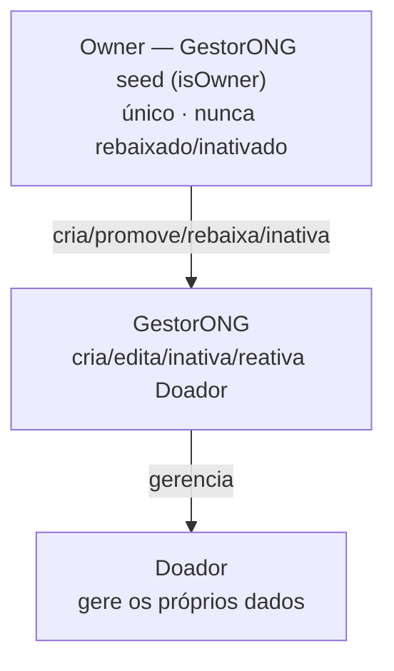
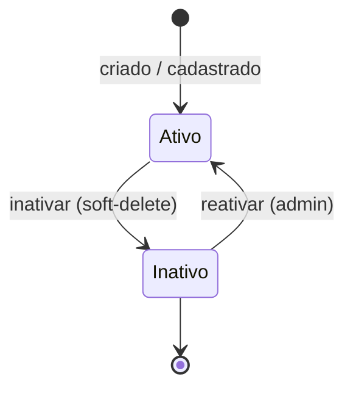

# PRD-02 — Gerenciamento de Usuários

## 1. Visão Geral
Administra o ciclo de vida dos usuários. Existe uma hierarquia: o **Owner** (GestorONG do seed)
está acima dos demais `GestorONG`, que por sua vez gerem os `Doador`. A exclusão é sempre lógica
(soft-delete) e cada usuário gere os próprios dados.

## 2. Atores / Personas
| Ator | Papel | Permissão (role) |
|------|-------|------------------|
| Owner | GestorONG do seed; super-admin único | `GestorONG` + flag `isOwner` |
| GestorONG | Administra Doadores | `GestorONG` |
| Doador | Gere apenas os próprios dados | `Doador` |

## 3. User Stories
- Como **Owner**, quero promover/rebaixar GestorONGs, para controlar quem administra a plataforma.
- Como **GestorONG**, quero criar/editar/inativar Doadores, para administrar a base de doadores.
- Como **GestorONG**, quero reativar um Doador inativo, para restaurar o acesso de quem solicitou reativação.
- Como **Doador**, quero ver e editar meus próprios dados, para manter meu cadastro atualizado.
- Como **usuário**, quero redefinir minha própria senha, para manter minha conta segura.

## 4. Requisitos Funcionais
| ID | Requisito | Prioridade |
|----|-----------|-----------|
| RF-1 | Gestão de Doadores (criar/editar/inativar) por qualquer `GestorONG` | Must |
| RF-2 | Gestão de GestorONGs e troca de role exclusiva do **Owner** 🆕 | Must |
| RF-3 | Inativação lógica (soft-delete) | Must |
| RF-4 | Autogestão de dados e senha pelo próprio usuário | Must |
| RF-5 | Seed do **Owner** no provisionamento | Must |

## 5. Regras de Negócio

**Matriz de permissões:**

| Ação | Doador | GestorONG | Owner |
|------|:------:|:---------:|:-----:|
| Gerir próprios dados / senha | ✅ | ✅ | ✅ |
| Criar / editar / inativar **Doador** | — | ✅ | ✅ |
| Criar **GestorONG** | — | — | ✅ |
| Promover Doador → GestorONG | — | — | ✅ |
| Rebaixar GestorONG → Doador | — | — | ✅ |
| Inativar **GestorONG** | — | — | ✅ |
| Reativar **Doador** (Inativo→Ativo) | — | ✅ | ✅ |
| Reativar **GestorONG** | — | — | ✅ |
| Rebaixar / inativar o **Owner** | — | — | ❌ nunca |

- **RN02.1** — Gestão de **Doadores** (criar, editar, inativar) pode ser feita por **qualquer `GestorONG`**. 🆕 *(revisa o RF02)*
- **RN02.2** — Existe um GestorONG inicial criado por seed — ele é o **Owner** (ver RN02.9).
- **RN02.3** — Exclusão é **lógica (soft-delete)**: usuário fica `Inativo`, nunca removido fisicamente.
- **RN02.4** — A senha só é redefinida **pelo próprio usuário**.
- **RN02.5** — Um `Doador` só acessa/edita os próprios dados.
- **RN02.6** — Senha segue a política de senha (Convenções Gerais).
- **RN02.7** — Sempre há **≥ 1 GestorONG ativo** — garantido pelo Owner, que nunca é inativado.
- **RN02.8** — As credenciais do **Owner (seed)** vêm de **secret/config (Key Vault)**, nunca hardcoded. 🆕
- **RN02.9** — O GestorONG do seed é o **Owner** (`isOwner = true`), é **único** e **nunca pode ser rebaixado nem inativado**. 🆕
- **RN02.10** — **Somente o Owner** pode: criar `GestorONG`, promover `Doador`→`GestorONG`, rebaixar `GestorONG`→`Doador` e inativar `GestorONG`. 🆕
- **RN02.11** — Um `GestorONG` comum **não** altera roles nem cria/inativa outros `GestorONG`. 🆕
- **RN02.12** — No próprio perfil, o usuário edita **nome/razão social**; **email e documento são imutáveis**; senha só via redefinição.
- **RN02.13** — A **reativação** de usuário inativo segue a mesma matriz da inativação: `Doador` por qualquer `GestorONG`; `GestorONG` pelo Owner. É o caminho de reativação citado no [[PRD-03 - Cadastro de Doador|PRD-03]] (RN03.9). 🆕

## 6. Requisitos Não-Funcionais
- **Segurança/Acesso:** RBAC com 401/403 (RNF20); checagem extra de `isOwner` nas ações sobre GestorONG; senha em hash BCrypt (RNF18); credenciais do Owner via Key Vault (RNF21).
- **Auditoria:** criação, edição, troca de role e inativação registradas em log estruturado (RNF24) — atenção especial às ações do Owner.
- **Privacidade:** soft-delete preserva histórico (RNF44).

## 7. Modelo de Domínio (DDD)
- **Bounded Context:** Identidade & Acesso → ver [[Bounded Contexts]].
- **Agregado:** `Usuario` (compartilhado com [[PRD-01 - Autenticação & Autorização|PRD-01]]).
- **Entidades / VOs:** `Usuario` (com flag `isOwner`); VOs `Email`, `Documento` (CPF/CNPJ), `Nome`/`RazaoSocial`, `Role`, `Status` (`Ativo`/`Inativo`).
- **Invariantes:** email único; documento único; **exatamente um Owner**, sempre `Ativo` e role `GestorONG`; sempre ≥ 1 `GestorONG` ativo; senha sempre em hash.

## 8. Contratos / API
| Método | Rota | Auth | Descrição |
|--------|------|------|-----------|
| POST | `/usuarios` | `GestorONG` (Doador) · `Owner` (GestorONG) | Cria usuário |
| PUT | `/usuarios/{id}` | `GestorONG` (Doador) · `Owner` (GestorONG / troca de role) | Edita usuário |
| PATCH | `/usuarios/{id}/inativar` | `GestorONG` (Doador) · `Owner` (GestorONG) | Inativa (soft-delete) |
| PATCH | `/usuarios/{id}/reativar` | `GestorONG` (Doador) · `Owner` (GestorONG) | Reativa um usuário inativo 🆕 |
| GET | `/usuarios` | `GestorONG` | Lista usuários |
| GET | `/usuarios/me` | autenticado | Dados do próprio usuário |
| PUT | `/usuarios/me` | autenticado | Edita o próprio perfil (nome/razão social) 🆕 |
| POST | `/usuarios/me/redefinir-senha` | autenticado | Redefine a própria senha |

## 9. Eventos de Domínio
- **Não** publica eventos cross-service. A inativação dispara internamente a **revogação dos refresh tokens** do usuário (RN01.11 / [[PRD-01 - Autenticação & Autorização|PRD-01]]).

## 10. Critérios de Aceite (Gherkin)
```gherkin
Cenário: GestorONG comum não mexe em outro GestorONG
  Dado um GestorONG comum (sem isOwner)
  Quando ele tenta rebaixar ou inativar outro GestorONG
  Então recebe 403 Forbidden

Cenário: Owner é intocável
  Dado o Owner
  Quando alguém (inclusive ele mesmo) tenta rebaixá-lo ou inativá-lo
  Então a operação é negada

Cenário: Apenas o Owner promove a GestorONG
  Dado um GestorONG comum
  Quando ele tenta promover um Doador a GestorONG
  Então recebe 403 Forbidden
  Mas quando o Owner faz a mesma ação, ela é permitida

Cenário: Exclusão é lógica
  Dado um GestorONG inativando um Doador
  Então o Doador fica Inativo e não é removido do banco
  E não consegue mais autenticar

Cenário: Reset de senha apenas pelo próprio usuário
  Dado um GestorONG tentando redefinir a senha de outro usuário
  Então a operação é negada

Cenário: Reativação de Doador inativo
  Dado um Doador Inativo
  Quando um GestorONG o reativa
  Então o Doador volta a Ativo e consegue autenticar novamente
```

## 11. Dependências e Integrações
- Depende de **PRD-01** (autorização). Relaciona-se com **RF03** (auto-cadastro de Doador).
- Serviço: **UserAPI**. Persistência: SQL Server (tabela `Usuario`).

## 12. Diagramas

**Hierarquia de papéis:**



**Estados do usuário:**



## 13. Fora de Escopo
- Recuperação de senha por email (ver PRD-01).
- Verificação/confirmação de email no cadastro.
- Edição de email/documento (imutáveis no MVP).
- Múltiplos Owners / transferência de Owner.
- Importação em massa, foto de perfil, campos adicionais.

## 14. Riscos / Pontos de Atenção
- **Owner é ponto único de poder:** perder as credenciais do Owner inviabiliza gerir GestorONGs. Mitigação: credenciais no Key Vault (RN02.8) e procedimento de recuperação documentado.
- **Lockout administrativo:** mitigado por RN02.7/RN02.9 (Owner sempre ativo).
- **Escalonamento de privilégio:** toda ação do Owner sobre roles deve ser auditada (RNF24).
- **Coerência com sessão:** inativar usuário precisa revogar refresh tokens (liga ao PRD-01).
```
