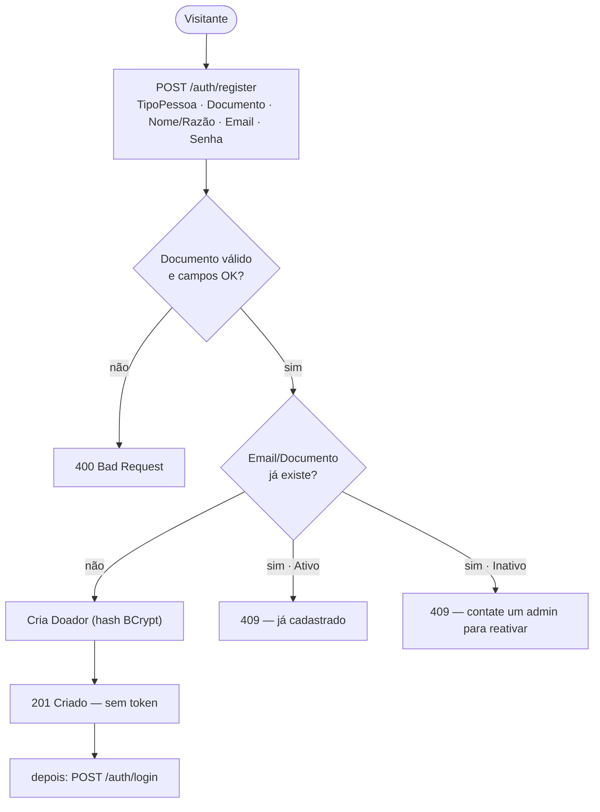

# PRD-03 — Cadastro de Doador (auto-cadastro PF/PJ)

## 1. Visão Geral
Permite que qualquer visitante crie sua própria conta de **Doador** (pessoa física ou jurídica),
sem intervenção da ONG. É o principal ponto de entrada público da plataforma e alimenta o login
(PRD-01) e o processo de doação (RF06).

## 2. Atores / Personas
| Ator | Papel | Permissão (role) |
|------|-------|------------------|
| Visitante | Usuário anônimo que se cadastra | — → vira `Doador` |

## 3. User Stories
- Como **visitante PF**, quero me cadastrar com CPF e nome completo, para poder doar.
- Como **visitante PJ**, quero me cadastrar com CNPJ e razão social, para doar como empresa.
- Como **visitante**, quero ser avisado se meu email/documento já existe, para saber que já tenho cadastro.

## 4. Requisitos Funcionais
| ID | Requisito | Prioridade |
|----|-----------|-----------|
| RF-1 | Auto-cadastro público de Doador (PF ou PJ) | Must |
| RF-2 | Validação de documento (CPF/CNPJ) com dígitos verificadores | Must |
| RF-3 | Unicidade de email e documento (inclui inativos) | Must |

## 5. Regras de Negócio
- **RN03.1** — O `Email` deve ser **único**; cadastro com email já existente é rejeitado (409) e a tela informa que já há cadastro.
- **RN03.2** — O `TipoPessoa` define o documento e o rótulo do nome: `PF` → `CPF` + `Nome Completo`; `PJ` → `CNPJ` + `Razão Social`.
- **RN03.3** — O `Documento` deve ser válido conforme o tipo: **CPF** (11 dígitos) ou **CNPJ** (14 dígitos), com validação dos **dígitos verificadores** (não só máscara).
- **RN03.4** — O `Documento` deve ser **único**.
- **RN03.5** — A senha é armazenada **somente** como hash (BCrypt).
- **RN03.6** — Todo usuário criado por este fluxo recebe a role `Doador`.
- **RN03.7** — Todos os campos são obrigatórios; senha segue a política de senha (Convenções Gerais).
- **RN03.8** — O cadastro **cria a conta (201) mas não autentica**; o doador deve fazer login em seguida (`POST /auth/login`, ver [[PRD-01 - Autenticação & Autorização|PRD-01]]). 🆕
- **RN03.9** — A unicidade considera **também usuários `Inativo`** (soft-delete): 🆕
  - se o email/documento pertencer a um usuário **`Ativo`** → **409** (já cadastrado);
  - se pertencer a um usuário **`Inativo`** → o sistema **não cria** nova conta e responde orientando a **entrar em contato com um administrador para reativar a conta** (a reativação é feita no [[PRD-02 - Gerenciamento de Usuários|PRD-02]]; não há auto-reativação pelo cadastro).

## 6. Requisitos Não-Funcionais
- **Segurança:** TLS (RNF17); senha só em hash BCrypt (RNF18); validação de entrada contra injeção/malformados (RNF23).
- **Anti-abuso:** endpoint público protegido por rate limiting no APIM (RNF22).
- **LGPD:** tratamento formal de dados pessoais está **fora de escopo** do MVP (RNF42 = Won't).

## 7. Modelo de Domínio (DDD)
- **Bounded Context:** Identidade & Acesso → ver [[Bounded Contexts]].
- **Agregado:** `Usuario` (compartilhado com [[PRD-01 - Autenticação & Autorização|PRD-01]] e [[PRD-02 - Gerenciamento de Usuários|PRD-02]]).
- **Entidades / VOs:** `Usuario`; VOs `Email`, `Documento` (CPF/CNPJ com validação), `TipoPessoa` (`PF`/`PJ`), `Nome`/`RazaoSocial`, `SenhaHash`, `Role`.
- **Invariantes:** email único; documento único e válido conforme o tipo; role sempre `Doador` neste fluxo.

## 8. Contratos / API
| Método | Rota | Auth | Request | Response |
|--------|------|------|---------|----------|
| POST | `/auth/register` | público | `{ tipoPessoa, documento, nome\|razaoSocial, email, senha }` | `201` (conta criada) / `400` (validação) / `409` (duplicado: ativo → já cadastrado; inativo → contatar admin para reativar) |

## 9. Eventos de Domínio
- **Não** publica eventos cross-service no MVP — ver [[Domain Events]].

## 10. Critérios de Aceite (Gherkin)
```gherkin
Cenário: Cadastro PJ com CNPJ válido
  Dado um visitante com TipoPessoa "PJ"
  Quando ele se cadastra com CNPJ válido e Razão Social
  Então a conta é criada (201) com a role Doador
  E nenhum token é retornado (login é separado)

Cenário: Email ou documento de conta ativa
  Dado que já existe usuário Ativo com o mesmo Email ou Documento
  Quando alguém tenta se cadastrar com ele
  Então recebe 409 informando que já há cadastro
  E nenhum usuário é criado

Cenário: Email ou documento de conta inativa
  Dado que existe usuário Inativo com o mesmo Email ou Documento
  Quando alguém tenta se cadastrar com ele
  Então recebe 409 orientando a contatar um administrador para reativar a conta
  E nenhum usuário é criado

Cenário: Documento inválido
  Quando alguém se cadastra com CPF/CNPJ de dígitos inválidos
  Então recebe 400 Bad Request
```

## 11. Dependências e Integrações
- Não depende de outro PRD. Habilita **PRD-01** (login) e **RF06** (doação).
- A reativação de conta inativa (RN03.9) é feita no **PRD-02** (ação de administrador).
- Serviço: **UserAPI**. Persistência: SQL Server (tabela `Usuario`).

## 12. Diagramas



## 13. Fora de Escopo
- Verificação/confirmação de email no cadastro.
- Auto-login pós-cadastro (decidido: login é separado).
- Auto-reativação de conta inativa pelo cadastro (vai para um administrador — PRD-02).
- Cadastro de `GestorONG` por este fluxo (só via Owner — PRD-02).
- Captura de consentimento LGPD (RNF42 fora de escopo).
- Cadastro social (Google etc.).

## 14. Riscos / Pontos de Atenção
- **Endpoint público** é alvo de bots/abuso → mitigar com rate limiting (RNF22) e validação rígida (RNF23).
- **Enumeração de contas:** as mensagens "já cadastrado" / "conta inativa, contate o admin" (RN03.1/RN03.9) revelam existência de conta — trade-off UX × privacidade.
- **Validação real de dígitos** CPF/CNPJ (RN03.3), não apenas formato/máscara.
```
