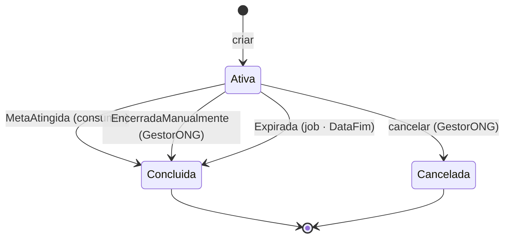

# PRD-04 — Gestão de Campanhas

## 1. Visão Geral
Permite ao `GestorONG` criar e manter campanhas de arrecadação. O `ValorArrecadado` é derivado das
doações (escrito só pelo consumer, nunca pela API). Uma campanha encerra de três formas — meta
atingida, prazo vencido ou encerramento manual — e o motivo fica registrado.

## 2. Atores / Personas
| Ator | Papel | Permissão (role) |
|------|-------|------------------|
| GestorONG | Cria e mantém campanhas | `GestorONG` |
| Sistema (consumer/job) | Conclui campanhas automaticamente | — (interno) |

## 3. User Stories
- Como **GestorONG**, quero criar e manter campanhas, para arrecadar para as causas.
- Como **GestorONG**, quero encerrar manualmente uma campanha, para parar a arrecadação quando necessário.
- Como **sistema**, quero concluir campanhas ao atingir a meta ou vencer o prazo, para refletir o estado real sem ação manual.

## 4. Requisitos Funcionais
| ID | Requisito | Prioridade |
|----|-----------|-----------|
| RF-1 | CRUD de campanhas restrito a `GestorONG` | Must |
| RF-2 | Conclusão automática por meta e por data + registro do motivo | Must |
| RF-3 | Encerramento e cancelamento manuais | Must |
| RF-4 | `ValorArrecadado` somente-leitura (escrito pelo consumer) | Must |

## 5. Regras de Negócio

**Ciclo de vida do status:**
```
Ativa ──(ValorArrecadado ≥ Meta · auto/consumer)──▶ Concluida [MetaAtingida]
Ativa ──(GestorONG encerra)───────────────────────▶ Concluida [EncerradaManualmente]
Ativa ──(DataFim vencida · auto/job)──────────────▶ Concluida [Expirada]
Ativa ──(GestorONG cancela)───────────────────────▶ Cancelada
Concluida / Cancelada = terminais (não voltam a Ativa)
```

- **RN04.1** — Apenas `GestorONG` cria, edita ou altera o status de campanhas.
- **RN04.2** — A `DataFim` não pode estar no passado no momento da criação.
- **RN04.3** — A `MetaFinanceira` deve ser maior que zero.
- **RN04.4** — `Status` ∈ { `Ativa`, `Concluida`, `Cancelada` }.
- **RN04.5** — Na criação, o status inicial é `Ativa`.
- **RN04.6** — `DataFim` ≥ `DataInicio`.
- **RN04.7** — `ValorArrecadado` é somente-leitura nesta capacidade (escrito apenas pelo consumer — RF06).
- **RN04.8** — `Concluida` ou `Cancelada` não voltam a `Ativa`.
- **RN04.9** — Ao virar `Concluida`, registra-se o **`MotivoConclusao`**: `MetaAtingida` · `EncerradaManualmente` · `Expirada`.
- **RN04.10** — Conclusão por **meta** ocorre no **consumer** da DonationAPI, no mesmo passo da consolidação do `ValorArrecadado` (idempotente).
- **RN04.11** — Conclusão por **data** é feita por um **BackgroundService periódico** na DonationAPI, que marca campanhas `Ativa` vencidas como `Concluida`/`Expirada`.
- **RN04.12** — Toda transição de status atualiza também o **read model (Cosmos)** para o Painel parar de listar a campanha encerrada (ver RF05).

## 6. Requisitos Não-Funcionais
- **Acesso:** RBAC, gestão restrita a `GestorONG` (RNF20).
- **Auditoria:** criação, edição e transições de status logadas (RNF24), incluindo o motivo e a origem (manual/auto).
- **Consistência:** conclusão por meta é eventualmente consistente, no mesmo lag da consolidação (RNF15).

## 7. Modelo de Domínio (DDD)
- **Bounded Context:** Campanhas → ver [[Bounded Contexts]].
- **Agregado:** `Campanha` (raiz).
- **Entidades / VOs:** `Campanha`; VOs `Periodo` (`DataInicio`/`DataFim`), `MetaFinanceira` (monetário), `Status`, `MotivoConclusao`.
- **Invariantes:** meta > 0; `DataFim ≥ DataInicio`; `ValorArrecadado` nunca via API; estados terminais; `MotivoConclusao` preenchido **se e somente se** `Concluida`.

## 8. Contratos / API
| Método | Rota | Auth | Descrição |
|--------|------|------|-----------|
| POST | `/campanhas` | `GestorONG` | Cria campanha (status inicial `Ativa`) |
| PUT | `/campanhas/{id}` | `GestorONG` | Edita dados (não o `ValorArrecadado`) |
| PATCH | `/campanhas/{id}/status` | `GestorONG` | Encerra manualmente ou cancela |
| GET | `/campanhas` | `GestorONG` | Lista todas (gestão) |
| GET | `/campanhas/{id}` | `GestorONG` | Detalha uma campanha |

## 9. Eventos de Domínio
- **Não** publica evento cross-service. A conclusão (por qualquer via) é aplicada na DonationAPI e **projetada no Cosmos** (RN04.12) — ver [[Domain Events]].

## 10. Critérios de Aceite (Gherkin)
```gherkin
Cenário: Bloquear meta inválida
  Quando um GestorONG cria campanha com MetaFinanceira = 0
  Então recebe 400 e a campanha não é criada

Cenário: Bloquear DataFim no passado
  Quando um GestorONG cria campanha com DataFim anterior a hoje
  Então recebe 400 e a campanha não é criada

Cenário: Conclusão automática por meta
  Dado uma campanha Ativa cujo ValorArrecadado atinge a Meta
  Quando o consumer consolida a doação
  Então a campanha vira Concluida com MotivoConclusao = MetaAtingida

Cenário: Conclusão automática por data
  Dado uma campanha Ativa com DataFim já vencida e meta não atingida
  Quando o BackgroundService roda
  Então a campanha vira Concluida com MotivoConclusao = Expirada

Cenário: Encerramento manual
  Dado uma campanha Ativa
  Quando o GestorONG a encerra
  Então vira Concluida com MotivoConclusao = EncerradaManualmente

Cenário: Estado terminal
  Dado uma campanha Concluida
  Quando alguém tenta voltá-la para Ativa
  Então a operação é negada
```

## 11. Dependências e Integrações
- Depende de **PRD-01** (autorização). Alimenta **RF05** (Painel) e **RF06** (doação).
- Serviço: **DonationAPI**. Persistência: SQL Server (escrita) + projeção no Cosmos DB (leitura).

## 12. Diagramas



## 13. Fora de Escopo
- Reabertura de campanhas terminais.
- Edição manual do `ValorArrecadado`.
- Categorias/tags, imagens, metas múltiplas/marcos.

## 14. Riscos / Pontos de Atenção
- **Janela do job de data (RN04.11):** entre a `DataFim` e a próxima execução, a campanha ainda fica `Ativa` — por isso a doação (RF06) valida também o período, não só o status.
- **Concorrência meta × doações:** conclusão por meta precisa ser idempotente (uma única transição).
- **Coerência do Painel:** toda conclusão deve atualizar o Cosmos (RN04.12), senão o Painel segue listando.
```
