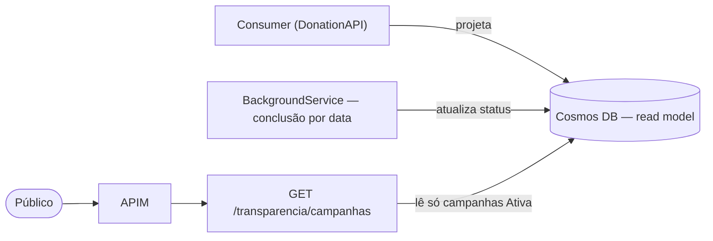

# PRD-05 — Painel de Transparência

## 1. Visão Geral
API pública que dá visibilidade às campanhas em andamento e ao quanto já arrecadaram. É a vitrine
de credibilidade da ONG. Lê **somente** do read model (Cosmos DB), alimentado pelo consumer e pelas
transições de status (RF04/RF06).

## 2. Atores / Personas
| Ator | Papel | Permissão (role) |
|------|-------|------------------|
| Público | Qualquer visitante, sem login | — |

## 3. User Stories
- Como **visitante**, quero ver as campanhas ativas e quanto já arrecadaram, para decidir apoiar.

## 4. Requisitos Funcionais
| ID | Requisito | Prioridade |
|----|-----------|-----------|
| RF-1 | Listar publicamente campanhas `Ativa` com Título, Meta e Valor Arrecadado | Must |
| RF-2 | Leitura servida pelo read model (Cosmos), sem tocar o SQL Server | Must |

## 5. Regras de Negócio
- **RN05.1** — Somente campanhas com status `Ativa` aparecem na listagem.
- **RN05.2** — O `Valor Total Arrecadado` é a soma das doações **processadas** (consolidadas pelo consumer), não das intenções recebidas.
- **RN05.3** — Endpoint **público** — não requer token.
- **RN05.4** — O valor reflete **consistência eventual**: representa o último processamento concluído, podendo estar atrás de uma doação recém-enviada.
- **RN05.5** — Campos sensíveis (dados de doadores, descrição interna) **não** são expostos.
- **RN05.6** — A leitura é servida **somente do read model (Cosmos DB)**; a API pública não consulta o SQL Server. 🆕
- **RN05.7** — Cada item traz Título, Meta, Valor Arrecadado e o **percentual** atingido (derivado). 🆕

## 6. Requisitos Não-Funcionais
- **Acesso:** público, sem autenticação (RN05.3).
- **Desempenho:** leitura de baixa latência servida pelo Cosmos (read model denormalizado).
- **Privacidade:** não expõe dados sensíveis (RNF43); LGPD fora de escopo no MVP (RNF42).
- **Consistência:** eventual, no lag da consolidação (RNF15).

## 7. Modelo de Domínio (DDD)
- **Bounded Context:** Transparência → ver [[Bounded Contexts]]. É um **read model**, não um agregado de escrita.
- **Fonte de dados:** projeção da `Campanha` no **Cosmos DB**, mantida por RF04 (transições) e RF06 (consolidação).
- **Documento (Cosmos):** `{ id: campanhaId, titulo, meta, valorArrecadado, status }` (ver [[Escolha de Bancos de Dados]]).

## 8. Contratos / API
| Método | Rota | Auth | Request | Response |
|--------|------|------|---------|----------|
| GET | `/transparencia/campanhas` | público | — | `200 [ { titulo, meta, valorArrecadado, percentual } ]` (apenas `Ativa`) |

## 9. Eventos de Domínio
- **Não** publica nem consome eventos diretamente. Consome a **projeção** mantida no Cosmos por RF04/RF06 — ver [[Domain Events]].

## 10. Critérios de Aceite (Gherkin)
```gherkin
Cenário: Listar apenas campanhas ativas
  Dado que existem campanhas Ativa, Concluida e Cancelada
  Quando o público consulta GET /transparencia/campanhas
  Então apenas as campanhas Ativa são retornadas
  E cada item exibe Título, Meta e Valor Arrecadado

Cenário: Não expõe dados sensíveis
  Quando o público consulta o painel
  Então nenhum dado de doador ou campo interno é retornado

Cenário: Valor reflete o consolidado
  Dado uma doação recém-aprovada ainda não consolidada
  Quando o público consulta o painel
  Então o valor pode estar atrás (consistência eventual), refletindo o último processamento
```

## 11. Dependências e Integrações
- Depende de **PRD-04** (campanhas) e **RF06** (consolidação do valor pelo consumer).
- Serviço: **DonationAPI** (rota pública). Persistência (leitura): **Cosmos DB**.

## 12. Diagramas



## 13. Fora de Escopo
- Detalhe por campanha (decidido: só a lista).
- Filtros/busca, paginação avançada, ordenação configurável.
- Histórico de campanhas encerradas.
- Qualquer dado de doadores.

## 14. Riscos / Pontos de Atenção
- **Consistência eventual:** o valor pode estar atrás de uma doação recém-aprovada (RN05.4) — comunicar isso na UI.
- **Read model desatualizado:** se a projeção no Cosmos falhar, o Painel diverge do SQL Server — monitorar o lag (RNF15/RNF29).
```
