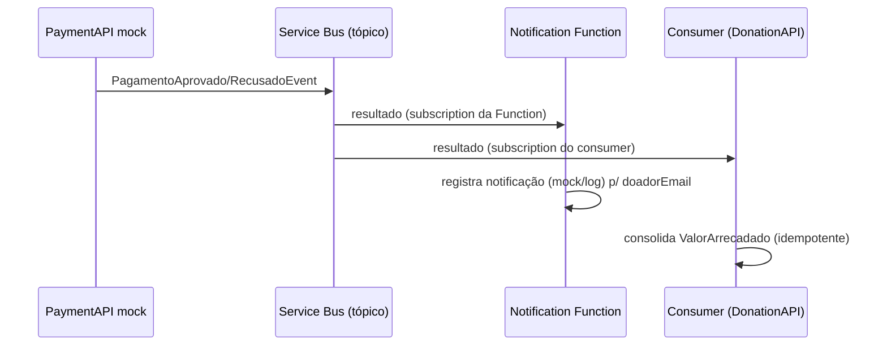

# PRD-07 — Notificação ao Doador

## 1. Visão Geral
Ao final do processamento de uma doação, o doador recebe uma **notificação assíncrona** informando se o pagamento foi **aprovado** ou **recusado**. A notificação é disparada por uma **Azure Function** dedicada (gerenciada, **fora do AKS**) acionada pelos eventos de resultado de pagamento no **Azure Service Bus**. No MVP o canal é **mock/log** (registra a notificação em log estruturado + Application Insights), **sem** provedor externo de email/SMS — coerente com o gateway de pagamento simulado. Complementa o acompanhamento por consulta do [[PRD-06 - Processo de Doação|PRD-06]].

## 2. Atores / Personas
| Ator | Papel | Permissão (role) |
|------|-------|------------------|
| Doador | Destinatário da notificação | `Doador` |
| Notification Function | Consome o resultado e notifica | — (serviço) |

## 3. User Stories
- Como **Doador**, quero ser avisado quando minha doação for aprovada, para ter confirmação do apoio.
- Como **Doador**, quero ser avisado quando o pagamento for recusado, para poder tentar novamente.

## 4. Requisitos Funcionais
| ID | Requisito | Prioridade |
|----|-----------|-----------|
| RF-1 | Notificar o doador quando o pagamento for **aprovado** | Must |
| RF-2 | Notificar o doador quando o pagamento for **recusado** | Must |
| RF-3 | Disparo assíncrono via consumo do Service Bus, sem acoplar à saga de arrecadação | Must |

## 5. Regras de Negócio
- **RN07.1** — A notificação é disparada **somente** após `PagamentoAprovadoEvent` ou `PagamentoRecusadoEvent`.
- **RN07.2** — Canal **mock/log** no MVP: a notificação é registrada (log estruturado + Application Insights); **sem** envio real de email/SMS.
- **RN07.3** — A Function é um **consumidor independente** do consumer de arrecadação da DonationAPI: usa **subscription própria** no tópico do Service Bus; uma falha aqui **não** afeta a consolidação do `ValorArrecadado`.
- **RN07.4** — A Function **não** escreve em banco de outro serviço nem altera `ValorArrecadado`/status da doação (somente leitura do evento).
- **RN07.5** — O destinatário (`doadorEmail`, `doadorNome`) vem **enriquecido no próprio evento** — a Function **não** consulta a UserAPI de forma síncrona.
- **RN07.6** — Entrega *at-least-once*: reprocessar o mesmo evento pode gerar log de notificação duplicado (aceitável no MVP); após o limite de tentativas a mensagem vai para a **DLQ**.

## 6. Requisitos Não-Funcionais
- **Resiliência:** *max delivery count* + **DLQ** na subscription da Function (RNF13).
- **Observabilidade:** logs/métricas em **Application Insights / Azure Monitor** — a Function roda fora do AKS, portanto fora do Prometheus/Grafana in-cluster.
- **Desacoplamento:** independência total da saga de arrecadação (pub/sub).

## 7. Modelo de Domínio (DDD)
- **Bounded Context:** Notificações (apoio/genérico) — ver [[Context Map]].
- **Sem agregado próprio:** reage a eventos de outro contexto; não persiste estado de domínio no MVP.
- **Invariantes:** nunca altera dados de Doações/Arrecadação; apenas notifica.

## 8. Contratos / API
- **Não expõe API HTTP.** É um worker orientado a evento (trigger `ServiceBusTrigger`).

## 9. Eventos de Domínio
| Evento | Publica | Consome | Quando |
|--------|---------|---------|--------|
| `PagamentoAprovadoEvent` | PaymentAPI | **Notification Function** (+ consumer da DonationAPI) | Mock aprovou |
| `PagamentoRecusadoEvent` | PaymentAPI | **Notification Function** (+ consumer da DonationAPI) | Mock recusou |
> Payloads enriquecidos com `doadorId`, `doadorEmail`, `doadorNome` — detalhe em [[Domain Events]].

## 10. Critérios de Aceite (Gherkin)
```gherkin
Cenário: Notificação de pagamento aprovado
  Dado um PagamentoAprovadoEvent na subscription da Function
  Quando a Notification Function o consome
  Então registra uma notificação "doação aprovada" para o doadorEmail do evento

Cenário: Notificação de pagamento recusado
  Dado um PagamentoRecusadoEvent na subscription da Function
  Quando a Notification Function o consome
  Então registra uma notificação "pagamento recusado" para o doadorEmail do evento

Cenário: Independência da arrecadação
  Dado que a Notification Function está indisponível
  Quando o consumer da DonationAPI processa o mesmo evento
  Então o ValorArrecadado é consolidado normalmente
```

## 11. Dependências e Integrações
- Consome eventos da **PaymentAPI** via **Azure Service Bus** (tópico + subscription própria).
- Depende do **enriquecimento dos eventos** com dados do doador — ver [[Domain Events]] e [[PRD-06 - Processo de Doação]].
- Observabilidade via Application Insights.

## 12. Diagramas


## 13. Fora de Escopo
- Envio **real** de email/SMS/push (provedor externo) — canal é mock/log no MVP.
- Preferências de canal / opt-out do doador.
- Templates de mensagem e internacionalização.
- Reenvio/retentativa de notificação além do *delivery count* do Service Bus.

## 14. Riscos / Pontos de Atenção
- **Reentrega** gera log de notificação duplicado (aceitável no MVP).
- **Observabilidade fragmentada:** a Function fica fora do dashboard Grafana in-cluster (vai para App Insights).
- **Dependência do enriquecimento:** se os eventos não carregarem `doadorEmail`, a notificação fica sem destinatário — garantir o enriquecimento na origem.

**Relacionados:** [[PRD-06 - Processo de Doação]] · [[Domain Events]] · [[Context Map]] · [[Visão Geral de Arquitetura]] · [[Requisitos Técnicos]]
