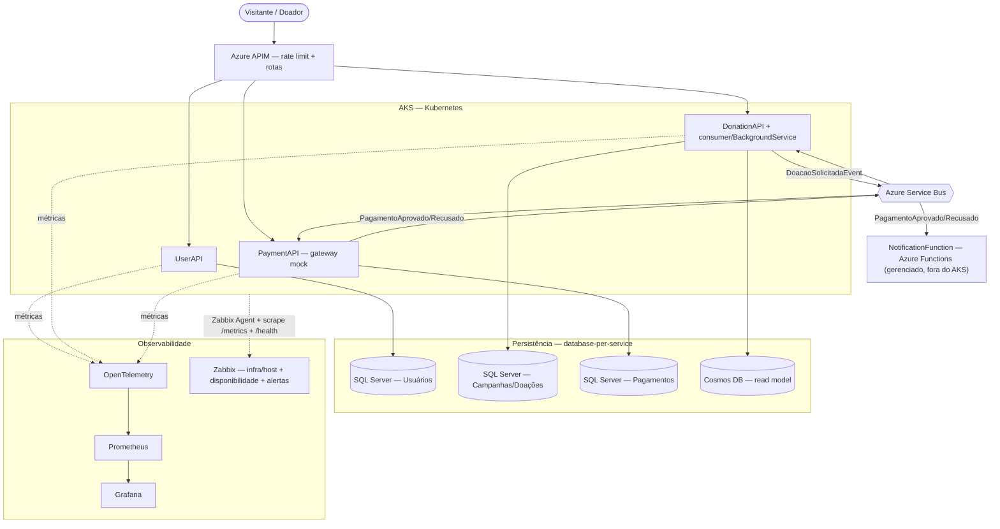

# Visão Geral de Arquitetura

> Arquitetura do MVP: 3 microsserviços em **AKS**, mensageria assíncrona (**Service Bus**), **CQRS** (SQL Server + Cosmos), observabilidade (**OpenTelemetry/Prometheus/Grafana** para aplicação/negócio + **Zabbix** para infra/host e disponibilidade) e **CI/CD** (GitHub Actions). Stack detalhada em [[Requisitos Técnicos]].

## Componentes
- **APIM (Azure):** porta de entrada das rotas públicas — rate limit e normalização.
- **UserAPI:** autenticação (JWT + refresh) e usuários — [[PRD-01 - Autenticação & Autorização|PRD-01]], [[PRD-02 - Gerenciamento de Usuários|PRD-02]], [[PRD-03 - Cadastro de Doador|PRD-03]].
- **DonationAPI:** campanhas, doações, Painel e o **consumer** que consolida a arrecadação — [[PRD-04 - Gestão de Campanhas|PRD-04]], [[PRD-05 - Painel de Transparência|PRD-05]], [[PRD-06 - Processo de Doação|PRD-06]].
- **PaymentAPI:** processamento de pagamento (gateway **mock**).
- **NotificationFunction:** Azure Function gerenciada (**fora do AKS**) que **notifica o doador** do resultado do pagamento (canal **mock/log**); consome os eventos de resultado por subscription própria — ver [[PRD-07 - Notificações|PRD-07]].
- **Azure Service Bus:** broker da saga de doação e do fan-out de notificação (tópico + subscriptions) — ver [[Domain Events]].
- **SQL Server:** escrita transacional, **um banco por serviço**.
- **Cosmos DB:** read model do Painel — ver [[Escolha de Bancos de Dados]].
- **Observabilidade:** OpenTelemetry → Prometheus → Grafana (métricas de aplicação e negócio). **Zabbix** monitora infraestrutura/host (CPU, memória, pods/nós) e disponibilidade/uptime, concentrando os alertas — coleta via *scrape* do `/metrics` (formato Prometheus), **Zabbix Agent** (templates host/K8s) e *web scenarios* em `/health` e `/ready`. Ver [[Decisões de Arquitetura (ADRs)|ADR-002]].

## Diagrama

**Relacionados:** [[Requisitos Técnicos]] · [[Context Map]] · [[Domain Events]] · [[Escolha de Bancos de Dados]]
